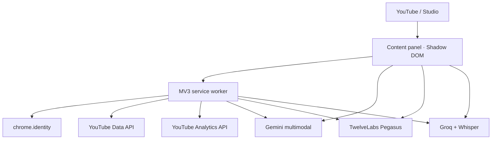

# Архитектура

## Компоненты

### Extension

Content script отвечает за UI и интеграцию с видимыми полями. Выбранный в Studio
файл, только после явного разрешения пользователя, уходит в AI API из скрытого
media-bridge iframe с origin расширения: ключи провайдеров не попадают в
процесс страницы. Private API Studio не вызываются. Service worker владеет OAuth, YouTube API,
кэшем, workspace-хранилищем, напоминаниями и минутным sampling. Все сообщения
типизированы и проверяются во время выполнения через `@channelpilot/shared`.

Дорогая история YouTube Analytics имеет TTL 15 минут. Отдельный минутный
collector обновляет только realtime-поля существующего dashboard-снимка через
сериализованную очередь. Single-flight не даёт popup, options и content script
одновременно запустить одинаковую полную синхронизацию.

Публичные запросы конкурентов и комментариев проходят через единый
AbortController-aware request cache. Ключ запроса имеет TTL, параллельные
одинаковые вызовы используют один Promise, а очистка кэша доступна из настроек.
Сохранение планера и других workspace-данных сериализовано, поэтому быстрые
изменения не могут завершиться в обратном порядке и вернуть старое состояние.

Options UI разделён на основной shell и `workspace-pages.tsx`; общие
Error Boundary и preference hook вынесены в `components/` и `hooks/`.
Расчёты realtime, Video Performance Score, SEO checklist, thumbnail diagnostics,
валидация сообщений и нормализация workspace находятся в shared-пакете и
покрыты изолированными unit-тестами.

Компактный realtime-виджет монтируется через отдельный Shadow DOM в flex-зону
шапки как обычного YouTube, так и YouTube Studio. MutationObserver и резервная
проверка восстанавливают mount после SPA-навигации и перестройки Polymer DOM,
не создавая дубликатов и не накрывая строку поиска.
Поиск anchor выполняется и через открытые Shadow DOM. Пока подходящий anchor
не найден, плавающая копия не показывается: это предотвращает появление
виджета в нижнем углу во время загрузки Studio.

### AI providers

По умолчанию extension обращается к Gemini, TwelveLabs и Groq напрямую с
ключами пользователя. Fastify backend сохранён как опциональный вариант для
командного production.
SEO-оценка рассчитывается детерминированно после генерации, поэтому UI не
доверяет случайному числу модели.

Маршрутизация видео `auto` использует цепочку Gemini → TwelveLabs → Groq.
TwelveLabs получает исходный видеофайл и анализирует временную структуру,
визуальный ряд, речь, звук и текст на экране; Groq остаётся быстрым
аудио/текстовым резервом. Для text-only запросов цепочка остаётся Gemini → Groq.
Мультимодальный результат содержит структурированные `thumbnailMoments`:
числовой таймкод, оценку пригодности 0–100, визуальное описание и объяснение.
UI валидирует и дедуплицирует моменты, а редактор извлекает выбранный кадр
локально из уже загруженного пользователем файла в исходном разрешении.
Дополнительный Gemini Image-поток может создать фон 16:9 или 9:16 по текстовому
брифу и текущему кадру-референсу. Заголовок остаётся отдельным локальным слоем,
поэтому модель не должна рисовать мелкий или нечитаемый текст.
Ошибки классифицируются по HTTP-коду и сообщению:
`429`, `500/503/504` и timeout получают максимум одну повторную попытку.
`Retry-After`, `google.rpc.RetryInfo` и текстовый `retry in …s` преобразуются в
единый cooldown. Когда доступен TwelveLabs или Groq, `auto` переключается сразу
и не расходует квоту Gemini повторными запросами в течение cooldown.

### Данные

| Данные                                       | Где находятся                      | Retention MVP                                              |
| -------------------------------------------- | ---------------------------------- | ---------------------------------------------------------- |
| Google access token                          | `chrome.storage.session`           | до закрытия browser session/expiry                         |
| Признак Google-подключения и номер аккаунта  | `chrome.storage.local`             | до явного выхода/смены Client ID                           |
| Выбор AI provider и моделей                  | `chrome.storage.local`             | до удаления extension                                      |
| Google Client ID, YouTube API key и AI keys  | `chrome.storage.local`             | до очистки/удаления extension                              |
| Realtime samples                             | `chrome.storage.local`             | скользящие 50 часов, максимум 56 активных серий            |
| Видимость виджета/AI-кнопки                  | `chrome.storage.local`             | до изменения пользователем                                 |
| Тема, плотность, положение панели            | `chrome.storage.local`             | до изменения/сброса пользователем                          |
| Конкуренты, идеи, planner, goals, AI history | `chrome.storage.local`             | нормализуется и ограничивается по количеству записей       |
| Dashboard cache                              | `chrome.storage.local`             | Analytics TTL 15 минут; realtime обновляется каждую минуту |
| Subscriber attribution                       | YouTube Analytics API              | последние 28 полных дней, до 50 последних видео            |
| Загруженный media                            | передаётся прямо выбранному AI API | не сохраняется extension                                   |
| Gemini Files object                          | Gemini Files API                   | удаляется после ответа                                     |
| TwelveLabs asset                             | TwelveLabs Assets API              | удаляется после анализа или ошибки                         |

## Масштабирование

Backend stateless относительно пользователя: после валидации bearer token
запрос может обслужить любой instance. Для больших видео обработку следует
вынести в очередь, вернуть `jobId`, хранить progress в Redis и удалить object
storage после установленного TTL.

Sampling сейчас выполняется локально каждым браузером. Серверный monitoring
канала требует отдельного явного согласия, offline OAuth refresh token,
зашифрованного vault и scheduler.

## Безопасность

- Scopes только read-only: `youtube.readonly` и `yt-analytics.readonly`.
  `commentThreads.list` с ними не работает (Google требует `youtube.force-ssl`
  с правом записи), поэтому публичные комментарии читаются по отдельному ключу
  YouTube Data API без OAuth-заголовка.
- OAuth token не записывается приложением в local storage.
- `chrome.storage.local` закрывается от untrusted content-script contexts через
  `TRUSTED_CONTEXTS`; настройки интерфейса передаются в панели типизированным RPC.
- Service worker отклоняет неизвестные типы сообщений, невалидные payload и
  сообщения от недоверенных sender URL; размер пользовательских строк ограничен.
- Общий cooldown AI-провайдеров также читается и обновляется через service
  worker RPC: перезагрузка YouTube не создаёт повторный шторм запросов, но
  защищённое хранилище остаётся недоступным странице.
- Истечение access token не удаляет сохранённое подключение: service worker
  пытается получить новый token без окна, повторяет запрос после 401 и только
  при требовании Google показывает явную кнопку подтверждения сессии.
- Provider keys отсутствуют в bundle и вводятся пользователем после установки.
- AI keys отправляются только на домены Gemini, TwelveLabs или Groq.
- Bearer header исключён из логов.
- CORS ограничивается extension ID в production.
- Размер body и media ограничен.
- Temp file создаётся с mode `0600` и удаляется при успехе и ошибке.
- Временные Gemini Files и TwelveLabs assets удаляются также после ошибки
  обработки или невалидного ответа.
- Контент панели изолирован Shadow DOM.
- Нет выполнения HTML или JavaScript, сгенерированного моделью.
- Экспорт настроек не включает Google Client ID и AI API keys; сообщения об
  ошибках проходят redaction URL-параметров, bearer-токенов и похожих на ключи
  значений.

## Известные ограничения MVP

- Пользовательские API keys хранятся локально; для общего компьютера или
  командного production рекомендуется server-side vault.
- Вставка в Studio основана на публичном DOM и может потребовать обновления
  selectors после редизайна YouTube.
- Groq-анализ видео использует аудиодорожку/транскрипт и не понимает визуальный
  ряд; полный visual analysis выполняют Gemini и TwelveLabs.
- Прямая загрузка TwelveLabs поддерживает видео до 200 МБ. Бесплатные 600 минут
  являются суммарной квотой и не возвращаются после удаления asset.
- Квоты Gemini применяются к Google Cloud/AI Studio project, а не к отдельному
  API key. Переключение на другой ключ того же project лимит не обходит.
- Realtime является собственной наблюдаемой оценкой, а не закрытым отчётом
  YouTube Studio.
- Targeted YouTube Analytics API не возвращает impressions/CTR для этого
  клиентского сценария; UI показывает `unavailable`, а не вычисляет их из
  посторонних метрик. Для bulk reach reports нужен отдельный Reporting API flow.
- Разбивка new/returning viewers отсутствует в используемом публичном Analytics
  API. `audienceType` относится к рекламному трафику и намеренно не используется
  как подмена.
- Снимки нормализуются до одного на минуту, счётчик защищён от кратковременного
  отката API, а сохранённая серия привязана к ID канала. Поэтому ручное
  обновление страницы не создаёт ложный ноль и данные разных каналов не
  смешиваются.
- Динамический OAuth Client ID типа «Веб-приложение» использует браузерный
  OAuth-flow без серверного refresh token. В большинстве случаев токен
  обновляется без окна; Google всё равно может потребовать повторное
  подтверждение после выхода из аккаунта, отзыва разрешения или политики
  безопасности.
- Атрибуция подписок по видео отражает действия со страницы просмотра видео;
  подписки с главной страницы канала и других поверхностей входят только в
  общую сводку.
