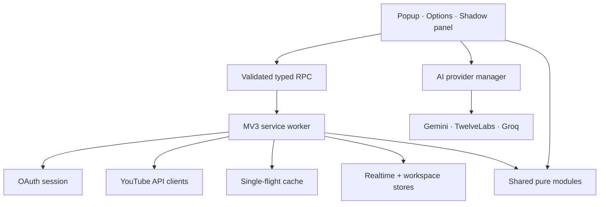

# Технический аудит ChannelPilot 0.17.0

Дата аудита: 28 июля 2026 года.

## Результат

Проект обновлён с 0.16.3 до 0.17.0. Сильные части исходной версии — Google
OAuth, наблюдаемый realtime, прямые AI-провайдеры, встроенные Studio-карточки и
редактор превью — сохранены. Поверх них добавлены проверяемые data-модули,
workspace-хранилище, адаптивная дизайн-система, безопасный runtime RPC,
прозрачные оценки и полноценная цепочка quality checks.

Автоматическая проверка релизного состояния выполняется одной командой:

```bash
npm run check
```

Она последовательно запускает ESLint, Prettier check, strict TypeScript, unit и
smoke tests, затем production build всех workspaces.

Финальный прогон завершён успешно:

- ESLint — без ошибок;
- Prettier — все проверяемые файлы отформатированы;
- TypeScript — shared, extension и API без ошибок;
- shared — 18 test files, 76 tests passed;
- API — 1 test file, 3 tests passed;
- direct AI integration smoke — passed;
- extension и backend production build — passed;
- built JavaScript syntax и manifest 0.17.0 — validated;
- `npm audit --omit=dev` — 0 vulnerabilities.

## Что было найдено и почему это было важно

| Проблема исходной версии                                                | Причина и риск                                                                                            | Исправление 0.17.0                                                                                                                           |
| ----------------------------------------------------------------------- | --------------------------------------------------------------------------------------------------------- | -------------------------------------------------------------------------------------------------------------------------------------------- |
| 48-часовое окно отсутствовало                                           | Локальная серия хранилась 26 часов, поэтому реальный 48h показатель получить было невозможно              | Retention увеличен до 50 часов, добавлены 48h aggregation и тесты границ окна                                                                |
| Видимая вкладка опрашивала данные каждые 30 секунд                      | Частота не настраивалась и могла расходовать квоту без пользы                                             | Интервалы 60/120/300 секунд, пауза при hidden document, минутный background alarm и общий throttle                                           |
| Нельзя было показать источники, страны и устройства                     | Analytics client загружал только общую сводку                                                             | Добавлены реальные dimension queries для traffic source, country, device type и subscribed status с частичной деградацией                    |
| CTR, impressions и new/returning легко было выдать за доступные метрики | Targeted Analytics API не отдаёт эти данные в используемом flow; `audienceType` означает рекламный трафик | UI показывает `unavailable` и объясняет отдельный Reporting API flow; подставных значений нет                                                |
| “Momentum” не имел прозрачной универсальной формулы                     | Пользователь не мог понять источник балла, а отсутствующие данные искажали результат                      | Video Performance Score 0–100 с шестью видимыми факторами, весами, источниками, confidence и перенормировкой доступных факторов              |
| Панель могла обрезаться на низком viewport/zoom                         | Жёсткое положение и размеры не учитывали изменение viewport                                               | Drag/resize, clamp, min/max size, восстановление layout, фиксированная шапка, внутренний scroll, мобильный full-screen режим                 |
| Не было полноценной светлой/автоматической темы                         | Цвета и blur были локальными несогласованными значениями                                                  | Общие tokens, dark/light/auto, live system-theme listener, четыре accents, transparency, density и motion settings                           |
| Большая UI-ошибка могла обрушить весь root                              | React Error Boundary отсутствовал                                                                         | Общий Error Boundary подключён к options, popup и content roots; пользователю показывается безопасный fallback                               |
| Runtime messages проверялись в основном только TypeScript-типами        | Типы исчезают в runtime; страница могла отправить неизвестный payload                                     | Добавлены allowlist sender-проверка, shape/length validation, ограничение payload и единый safe response                                     |
| Ошибки могли содержать bearer token, URL query или API key              | Сообщение внешнего API попадало в UI почти без нормализации                                               | Централизованные `safeErrorMessage` и `redactSecrets`, секретные паттерны вырезаются до логирования/показа                                   |
| Настройки нельзя было безопасно переносить                              | Полный export мог случайно включить секретные поля                                                        | Экспортируется только UI/privacy schema; Google Client ID и AI keys исключены                                                                |
| Медиа могло автоматически попасть к AI после выбора файла Studio        | Не было отдельного privacy consent для передачи изображения/аудио/видео                                   | `allowAiMediaUploads` выключен по умолчанию; auto-capture и AI thumbnail audit блокируются до явного включения                               |
| AI text request нельзя было реально отменить                            | UI мог перестать ждать, но сеть продолжала работу                                                         | Text clients принимают `AbortSignal`; кнопка Cancel вызывает AbortController                                                                 |
| AI выдавал меньше требуемых вариантов и мало типов assets               | Prompt/schema были ориентированы на семь заголовков и базовое описание                                    | Минимум 10 заголовков, девять title modes, short/full description, hashtags, pinned comment, script outline, Shorts ideas и thumbnail prompt |
| Прямая вставка могла затереть черновик Studio                           | Действие меняло DOM без предпросмотра значения                                                            | Модальное сравнение старого/нового текста и явное подтверждение; inline-карточки по умолчанию копируют                                       |
| Общего кэша для новых API-модулей не было                               | Повторный поиск конкурента или комментариев создавал одинаковые запросы                                   | TTL single-flight request cache с AbortController, force refresh и ручной очисткой                                                           |
| Сохранения workspace могли завершаться не по порядку                    | Быстрые textarea/drag изменения создают параллельные storage RPC                                          | Клиентская последовательная очередь и sequence guard; background дополнительно нормализует состояние                                         |
| Классификация comment spam могла меняться между одинаковыми вызовами    | Повторно использовались RegExp с флагом `g`, который хранит `lastIndex`                                   | Stateful flags удалены, добавлен regression test повторного вызова                                                                           |
| Планер поддерживал только JSON                                          | Требование CSV и spreadsheet safety не было реализовано                                                   | RFC-style CSV import/export, multiline/quote parser, нейтрализация formula cells и unit tests                                                |
| Thumbnail score мог восприниматься как CTR-прогноз                      | Не было независимой технической диагностики с явной семантикой                                            | Локальные brightness/contrast/saturation/edge metrics, технический score и несколько surface previews; AI-аудит отдельно помечен estimate    |
| Новые продуктовые разделы отсутствовали                                 | Options UI был сосредоточен на dashboard, AI и editor                                                     | Добавлены competitors, ideas, planner/calendar/goals, comments, SEO checklist и Upload Assistant                                             |
| Не было единого lint/format gate                                        | Style и часть ошибок можно было пропустить перед сборкой                                                  | ESLint 9 flat config, Prettier и корневая команда `npm run check`                                                                            |

## Новые рабочие функции

### Аналитика и данные

- наблюдаемые окна 60 минут, 24 и 48 часов;
- Analytics breakdown по источникам трафика, странам, устройствам и статусу
  подписки;
- последний успешный refresh и состояния live/cached/delayed/unavailable;
- прозрачный Performance Score и SEO checklist;
- локальная техническая диагностика превью;
- публичное исследование каналов-конкурентов через YouTube Data API;
- реальные top-level comments через `commentThreads.list`.

### AI и workflow

- минимум 10 оценённых заголовков;
- режимы SEO, Viral, Curiosity, Clean, Educational, Story, Challenge, Versus и
  Documentary;
- профессиональный, вирусный, эмоциональный, образовательный,
  развлекательный, драматичный и минималистичный тон;
- полное/короткое описание, теги, keywords, hashtags, chapters, pinned comment,
  thumbnail prompt, script outline и Shorts ideas;
- AbortController для text generation, status, history и favorites;
- Idea Generator с форматами versus/challenge/experiment/documentary/trend,
  evergreen и series;
- Comment Assistant с фильтрами, локальной частотной сводкой, выбором тона,
  одиночными и пакетными AI-черновиками;
- AI thumbnail audit текущего canvas, только после privacy opt-in;
- Upload Assistant на страницах Studio с семью проверяемыми шагами.

### Workspace и интерфейс

- сохранённые конкуренты;
- идеи с переносом в planner;
- kanban drag-and-drop, даты, заметки, поиск, JSON/CSV import/export;
- компактный календарь ближайших публикаций;
- цели канала с ручным прозрачным progress;
- Chrome notifications перед запланированной публикацией;
- dark/light/auto theme, accents, transparency, density и reduced motion;
- переносимая, изменяемая и сворачиваемая content panel;
- адаптивная нижняя навигация кабинета на узких экранах.

## Архитектура после изменений



- `packages/shared` содержит DTO, runtime message validation, settings/workspace
  normalization, realtime aggregation, scores, checklist, thumbnail и comment
  utilities.
- `apps/extension/src/background` владеет OAuth, YouTube requests, кэшами,
  realtime store, workspace store и reminders.
- `apps/extension/src/options/workspace-pages.tsx` изолирует новые продуктовые
  разделы от legacy shell.
- `components/ErrorBoundary.tsx` и `hooks/useInterfacePreferences.ts` повторно
  используются UI roots.
- `apps/extension/src/lib/ai-direct.ts` остаётся единым direct provider manager.
- `apps/api` остаётся необязательным Fastify backend с тем же расширенным
  AnalysisResult contract.

## Реальные данные, производные показатели и AI estimates

| Категория                     | Функции                                                                                                                                                                                          | Маркировка                                                            |
| ----------------------------- | ------------------------------------------------------------------------------------------------------------------------------------------------------------------------------------------------ | --------------------------------------------------------------------- |
| Реальные API-данные           | channel/video public counters, даты, duration, likes/comments, 7/28d analytics, watch time, retention, subscriptions, traffic/country/device/subscribed breakdowns, competitor uploads, comments | `YouTube Data API`, `YouTube Analytics API` или `API verified`        |
| Наблюдаемые данные            | 15/60m и 24/48h deltas из локальных snapshots                                                                                                                                                    | `observed`, coverage и время refresh; это не закрытый realtime Studio |
| Детерминированные производные | engagement rate, per-hour pace, median, upload frequency, Performance Score, SEO checklist, comment flags, thumbnail technical score                                                             | Формула/источник видны; это не AI                                     |
| AI estimates                  | качество упаковки идеи, title scores, hook/retention risks, thumbnail observations, recommendations, сценарии, Shorts и прогнозные формулировки                                                  | `AI`, `estimate` и предупреждение об отсутствии гарантии              |
| Недоступно                    | targeted impressions/CTR, new/returning viewers, playlist/cards/end-screen/pinned state                                                                                                          | `unavailable`/`unknown`, значение не подменяется                      |

## Ограничения YouTube API

- Realtime основан на новых значениях публичных counters и виден сразу после их
  появления в API, но сам YouTube может обновлять counters с задержкой.
- Targeted YouTube Analytics query не предоставляет impressions и CTR в
  используемом browser flow. Reach metrics требуют отдельной подписки на bulk
  reports через YouTube Reporting API.
- Публичная Analytics dimension `audienceType` описывает organic/in-stream
  рекламный трафик, а не new/returning viewers.
- `search.list` расходует значительную квоту. По возможности competitor lookup
  использует channel ID/handle и TTL cache.
- Read-only scopes не позволяют надёжно подтвердить cards, end screens, playlist
  membership и pinned comment status и не позволяют публиковать ответы.
- Public counters, Analytics reports и Studio UI могут обновляться в разное
  время; источник и момент обновления должны учитываться при сравнении.
- Динамический OAuth flow не хранит offline refresh token. После выхода,
  отзыва consent или политики Google может потребоваться интерактивная
  re-authorization.
- Content integration опирается на публичный DOM YouTube Studio; крупный
  будущий редизайн может потребовать обновить selectors.

## Приватность и безопасность

- OAuth access token находится в `chrome.storage.session`, а не в local storage.
- Используются read-only YouTube scopes.
- API keys отсутствуют в bundle, маскируются в UI и исключаются из export.
- Content script не читает `chrome.storage.local` напрямую после установки
  `TRUSTED_CONTEXTS`; получает только безопасную часть настроек через RPC.
- Runtime sender, type и payload валидируются.
- Нет `eval`, `dangerouslySetInnerHTML` или исполнения model-generated HTML.
- URL внешних переходов формируются из проверенных YouTube IDs.
- Media uploads выключены по умолчанию; выбранный файл передаётся только
  выбранному AI API и не сохраняется расширением.
- Gemini Files и TwelveLabs assets удаляются после успеха или ошибки.
- Reset data требует подтверждения, cache можно очищать отдельно.

## Исправленные и добавленные файлы

### Корень и документация

- `package.json`, `package-lock.json`;
- `eslint.config.js`, `.prettierrc.json`, `.prettierignore`;
- `README.md`;
- `docs/ARCHITECTURE.md`, `docs/USER_FLOWS.md`;
- `docs/AUDIT-0.17.0.md`, `docs/MANUAL-TEST-CHECKLIST.md`.

### Shared contract и чистая логика

- изменены `types.ts`, `settings.ts`, `realtime.ts`, `analytics.ts`, `seo.ts`,
  `ai-errors.ts`, `index.ts`;
- добавлены `messages.ts`, `panel.ts`, `performance.ts`, `seo-checklist.ts`,
  `workspace.ts`, `comments.ts`, `thumbnail.ts`, `errors.ts`;
- добавлены/обновлены unit tests для realtime, messages, panel, scores,
  checklist, workspace/CSV, comments, thumbnail, settings, errors и AI models.

### Extension

- `manifest.ts`;
- background: `google-auth.ts`, `youtube.ts`, `realtime-store.ts`,
  `service-worker.ts`, новые `request-cache.ts`, `workspace-store.ts`,
  `reminders.ts`;
- UI: `content/index.tsx`, `content/styles.ts`, `popup/main.tsx`,
  `popup/popup.css`, `options/main.tsx`, `options/options.css`, новый
  `options/workspace-pages.tsx`;
- общие UI-модули: `components/ErrorBoundary.tsx`,
  `hooks/useInterfacePreferences.ts`;
- AI/RPC: `lib/ai-direct.ts`, `lib/rpc.ts`;
- `public/icon.svg`, direct AI smoke test, package/tsconfig.

### Опциональный backend

- `analysis.ts`, `prompt.ts`, `index.ts`, `auth.ts`;
- provider implementations и `provider-utils.ts`;
- package/tsconfig и auth tests.

## Установка и запуск

Требования: Node.js 22+ и Chromium/Chrome 120+.

```bash
npm install
npm run dev:extension
```

Production:

```bash
npm run check
npm run build
```

Готовая распакованная сборка находится в `apps/extension/dist`.

1. Открыть `chrome://extensions`.
2. Включить Developer mode.
3. Нажать **Load unpacked**.
4. Выбрать `apps/extension/dist`.
5. После новой сборки нажать Reload у расширения и полностью обновить уже
   открытые вкладки YouTube/Studio.

## Google OAuth и YouTube API

1. В одном Google Cloud project включить YouTube Data API v3 и YouTube
   Analytics API.
2. Настроить OAuth consent screen; в Testing добавить нужный аккаунт в Test
   users.
3. Создать OAuth Client ID типа **Web application**.
4. В настройках расширения скопировать фактический redirect URI и без изменений
   добавить в Authorized redirect URIs.
5. Вставить Client ID, сохранить и нажать вход.

Client secret расширению не нужен. Gemini API key нельзя вставлять в поле OAuth
Client ID.

## Gemini, TwelveLabs и Groq

1. Получить ключи только в официальных кабинетах провайдеров.
2. Вставить один или несколько keys в Connections.
3. Выбрать model/provider mode и нажать проверку keys.
4. В Auto text идёт Gemini → Groq, video — Gemini → TwelveLabs → Groq.
5. Для изображения, аудио или видео отдельно включить media uploads в Privacy.

Без AI key аналитика, планер, competitor data, comments, SEO checklist и
локальный thumbnail editor продолжают работать. AI-кнопки показывают
диагностическую ошибку, а не фиктивный ответ.

## Остаточные ограничения

- Полноценный end-to-end тест с реальным YouTube-каналом, квотой и OAuth нельзя
  автоматизировать без пользовательских credentials; он вынесен в ручной
  чек-лист.
- YouTube Studio остаётся внешним SPA с нестабильным DOM.
- `options/main.tsx` и `content/index.tsx` всё ещё содержат крупные legacy
  композиционные части. Data/storage/scoring и новые product pages уже вынесены,
  но дальнейшее дробление editor/provider-specific UI упростит независимые
  React component tests.
- Массовые AI-черновики выполняются последовательно и ограничены десятью
  видимыми комментариями, чтобы не создавать rate-limit storm.
- AI visual audit вероятностный: OCR, лицо, эмоция и композиция зависят от
  выбранной мультимодальной модели и никогда не трактуются как гарантия CTR.
- Browser notification зависит от разрешений Chrome и работающего профиля;
  расширение не является серверным scheduler.

Полный ручной сценарий: [`MANUAL-TEST-CHECKLIST.md`](MANUAL-TEST-CHECKLIST.md).
